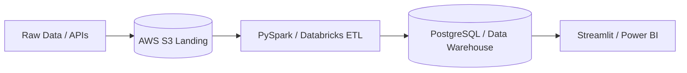

<!-- En README.md (Inglés) -->

  🌐 <b>English</b> | <a href="README.es.md">Español</a>

  

## 👋 Hi, I'm [Tu Nombre]
Software & Data Engineer focused on...

  

Markdown

  

```mermaid
flowchart LR
    A[Raw Data / APIs] --> B[(AWS S3 Landing)]
    B --> C[PySpark / Databricks ETL]
    C --> D[(PostgreSQL / Data Warehouse)]
    D --> E[Streamlit / Power BI]
```

